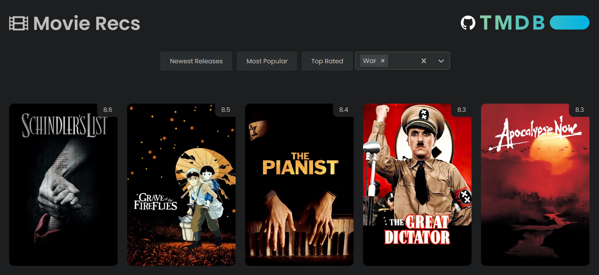

# Movies Recommendation App
## ⚠️ Attention
This project is a work in progress. Still have quite a lot of work to do:
- authentication, with Spring Security
- Movie page design and display
- Might do a list of favorites and then add a "recommendations" category based on those favorites

Key challenges in this project include integrating with a movie API to fetch real-time data, storing it in database, designing an intuitive and visually appealing user interface, implementing navigation between different pages efficiently, managing state and data flow within the React components.

A full stack movies recommendation application using React and Spring Boot.



## Table of Contents
- [Features](#features)
- [Technologies Used](#technologies-used)
- [Getting Started](#getting-started)
- [Running the App](#running-the-app)
- [Usage](#usage)
- [API Documentation](#api-documentation)
- [Testing](#testing)
- [Contributing](#contributing)
- [License](#license)

## Features
- User authentication and authorization
- Personalized movie recommendations
- Movie search functionality
- User reviews and ratings

## Technologies Used
### Frontend
- React
- Redux
- Axios

### Backend
- Spring Boot
- Hibernate
- PostgreSQL

## Getting Started
### Prerequisites
- Node.js
- Java
- PostgreSQL

### Installation
1. Clone the repo
   ```bash
   git clone https://github.com/yourusername/movies-recommendation-app.git
